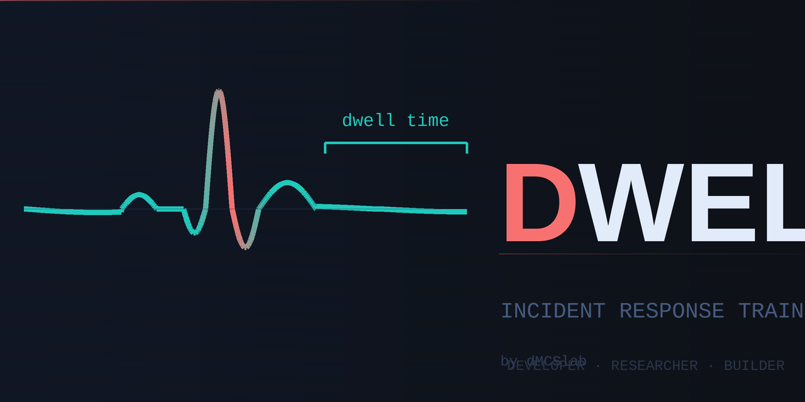

<p align="center">
  
</p>

<h1 align="center">Dwell — Incident Response Training Platform</h1>

<p align="center">
  Step through realistic ransomware incidents as an analyst. Make decisions. See the consequences.
  <br/>
  <strong>Built for SOC onboarding, blue team exercises, and security awareness training.</strong>
</p>

<p align="center">
  
  
  
  
</p>

> **The name.** Dwell time is the number of days an attacker spends inside a network before detection. The average is measured in weeks. Every second of this simulation, that clock is ticking.

---
**Live demo:** [DEMO](https://playdwell.dmcslab.com)
---

## ⚡ Quick Start — No Configuration Needed

**Requirements:** [Docker Desktop](https://docs.docker.com/get-docker/) (includes everything else)

### macOS / Linux

```bash
git clone https://github.com/dmcslab/Dwell.git
cd dwell
./start.sh
```

### Windows

```
git clone https://github.com/dmcslab/Dwell.git
cd dwell
start.bat
```

Then open **http://localhost:5173** in your browser.

> First run downloads and builds images (~2 min). Subsequent starts take seconds.

**Default admin credentials:**
```
Username: admin
Password: Dwell!Change123
```
Change the password via the Admin panel after first login.

---

## What Is This?

Dwell puts you in the middle of an active ransomware incident. You are an analyst — not reading a case study, but making real-time decisions:

- Do you contain first or collect forensic evidence?
- Do you restore from backup or check for persistence first?
- Did you just tip off an active operator by sequential isolation?

Wrong decisions have **narrative consequences** — choose poorly at containment and the next stage becomes "ransomware reached the Domain Controller" instead of a clean eradication. True branching simulation, not multiple-choice quizzes.

---

## Features

| Feature | Details |
|---|---|
| **43 IR scenarios** | 3 easy / 17 medium / 23 hard, all with branching consequences |
| **4 IR phases each** | Preparation → Detection → Containment → Eradication & Recovery |
| **NIST SP 800-61r2** | Every stage maps to the incident response lifecycle |
| **MITRE ATT&CK TTPs** | Technical explanations reference real attacker techniques |
| **Multi-player** | Share a link — multiple analysts join the same live session |
| **4 analyst roles** | IR Lead, Network, Endpoint, Solo — each sees different context |
| **Spectator mode** | Watch live sessions without affecting gameplay |
| **Scenario branching** | Wrong choices redirect to crisis stages, not just cost attempts |
| **Debrief report** | Lessons learned + PDF export after every session |
| **Admin panel** | Full scenario CRUD — build your own without touching JSON |
| **Dark / light mode** | Persisted theme toggle |
| **Self-hosted** | Your data never leaves your server |

---

## Stopping and Restarting

```bash
# Stop (data is preserved in Docker volumes)
./stop.sh          # macOS/Linux
stop.bat           # Windows

# Restart
./start.sh         # macOS/Linux
start.bat          # Windows
```

---

## Cloudflare Tunnel (Share Over the Internet)

To make the app accessible to remote participants without opening firewall ports:

1. Install [cloudflared](https://developers.cloudflare.com/cloudflare-one/connections/connect-networks/downloads/)
2. Create a tunnel: `cloudflared tunnel create dwell`
3. Point it at `http://localhost:5173`
4. Start the app: `./start.sh`
5. Start the tunnel: `cloudflared tunnel run dwell`

**No code changes required.** The app auto-detects the public URL from request headers and generates correct share links automatically.

Full setup guide: [CLOUDFLARE_TUNNEL.md](CLOUDFLARE_TUNNEL.md)

---

## Upgrading Dwell

Run the upgrade script from the repo root. It checks GitHub for updates, and if any are available, downloads and applies them while preserving all your data and configuration.

**macOS / Linux**
```bash
./upgrade.sh
```

**Windows**
```
upgrade.bat
```

If you are already on the latest version, the script will tell you and exit — nothing is changed.

---

### What gets preserved

| Item | Safe? |
|---|---|
| All game sessions and history | ✅ Always |
| User accounts and passwords | ✅ Always |
| Custom scenarios built in the Admin panel | ✅ Requires `SKIP_SEED_UPDATE=true` in `backend/.env` |
| Your `backend/.env` configuration | ✅ Backed up before the update, restored automatically if changed |

---

### Before your first upgrade — one-time setup

If you have built custom scenarios through the Admin panel, add this line to `backend/.env` to protect them:

```bash
SKIP_SEED_UPDATE=true
```

Without it, the seed script will overwrite custom scenarios on restart. Set it once and you will never need to worry about it again.

---

### What the script does

1. Fetches the latest code from `https://github.com/dmcslab/Dwell.git` (branch: `main`) **without changing anything locally**
2. If no updates are found — exits immediately with a message
3. If updates are found — shows a summary of what is new
4. Backs up `backend/.env`
5. Stops containers — your database and session data are untouched
6. Pulls the updates
7. Restores your `.env` if the update modified it
8. Rebuilds images and restarts services
9. Automatically rebuilds the scenario-worker image if its files changed

---

### Manual upgrade (if you prefer)

```bash
# macOS / Linux
git pull origin main
docker compose up -d --build

# Only if scenario-worker files changed
./build_worker.sh
```

---

### ⚠ What NOT to do

```bash
# NEVER run this — the -v flag destroys your database and all data
docker compose down -v
```

`docker compose down` without `-v` is completely safe — volumes are always preserved.

---

### Something went wrong?

Your `.env` is always backed up at `backend/.env.upgrade-backup` before any changes are made. To restore it:

```bash
cp backend/.env.upgrade-backup backend/.env
docker compose restart backend
```

To roll back to a previous version:

```bash
git log --oneline -10          # find the version you want
git checkout <commit-hash>
docker compose up -d --build
```
---

## Security Notes

Dwell is designed for **local / private-network deployment** as a training tool.
A few defaults are intentionally permissive for ease of use — here is what to
know before exposing the app externally.

| Setting | Default | Notes |
|---|---|---|
| DB credentials | `dwell:dwell` | Internal Docker network only — the database port is never exposed to the host |
| `SECRET_KEY` | auto-generated | A random key is generated per process startup. Sessions survive container restarts only if you set a fixed key in `backend/.env` (see below) |
| Admin password | `Dwell!Change123` | **Change this after first login** via Admin → Users |
| `ALLOWED_ORIGINS` | `*` | Safe because the only exposed port (5173) is the Vite proxy — the backend is not directly reachable |
| `--forwarded-allow-ips=*` | Enabled | Required for Cloudflare Tunnel — the tunnel forwards headers from an undetermined internal IP |

### Setting a persistent SECRET\_KEY

If you want login sessions to survive a container restart, add a fixed key to
`backend/.env`:

```bash
# generate a key
python3 -c "import secrets; print(secrets.token_hex(32))"

# paste the output into backend/.env
SECRET_KEY=<your-generated-key>
```

Without this, a new random key is generated on every startup and all existing
JWT tokens are invalidated (users will need to log in again after a restart).
This is fine for ephemeral training sessions; set a fixed key if you run
persistent multi-day exercises.

---

## Architecture

```
Browser (any URL)
    │
    │ HTTP / WSS  :5173
    ▼
┌─────────────────────────┐
│   Vite Dev Server       │  ← only port exposed to host
│   React + TypeScript    │
│   /api/* → backend:8000 │  ← internal proxy
└──────────┬──────────────┘
           │ (Docker internal network)
           ▼
┌─────────────────────────┐    ┌────────────┐
│   FastAPI Backend       │───►│ PostgreSQL │
│   Python 3.12           │    └────────────┘
│   WebSocket game loop   │    ┌────────────┐
│                         │───►│   Redis    │
└──────────┬──────────────┘    └────────────┘
           │
           ▼
┌─────────────────────────┐
│   Orchestrator          │  ← manages per-session worker containers
│   docker-py             │
└─────────────────────────┘
```

DB and Redis are **not exposed** to the host — internal Docker network only.

---

## Customisation

### Change the admin password

Log in → click ⚙ Admin → Users tab → edit the admin account.

### Create your own scenarios

Log in → ⚙ Admin → Scenarios tab → **+ New Scenario** → follow the 4-step builder.
No JSON or code required.

### Add more users

Admin → Users → **+ Add User**

---

## Tech Stack

| Layer | Technology |
|---|---|
| Frontend | React 18, TypeScript, Tailwind CSS, Vite |
| Backend | FastAPI, Python 3.12, asyncpg, SQLAlchemy |
| Database | PostgreSQL 16 |
| Cache / Pub-Sub | Redis 7 |
| Auth | JWT (access) + opaque refresh tokens in Redis |
| Containers | Docker, Docker Compose |
| Fonts | Syne, IBM Plex Sans, IBM Plex Mono |

---

## Contributing

See [CONTRIBUTING.md](CONTRIBUTING.md).

---

## License

Dwell is free software: you can redistribute it and/or modify it under the terms of the
**GNU General Public License v3.0** as published by the Free Software Foundation.

See [LICENSE](LICENSE) for the full text.

This program is distributed in the hope that it will be useful, but **without any warranty** —
without even the implied warranty of merchantability or fitness for a particular purpose.

---

<p align="center">
  Built by <strong><a href="https://github.com/dmcslab">dMCSlab</a></strong>
</p>
