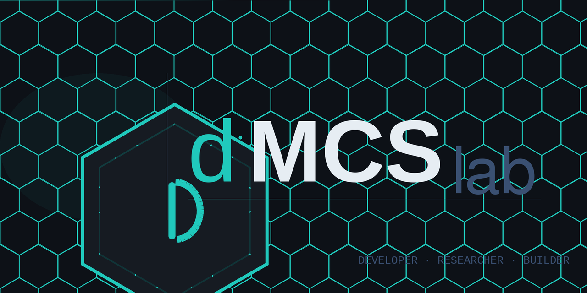

<p align="center">
  
</p>

<h1 align="center">Cyber-Rans — Cybersecurity IR Training Platform</h1>

<p align="center">
  Step through realistic ransomware incidents as an analyst. Make decisions. See the consequences.
  <br/>
  <strong>Built for SOC onboarding, blue team exercises, and security awareness training.</strong>
</p>

<p align="center">
  
  
  
  
</p>

---

## ⚡ Quick Start — No Configuration Needed

**Requirements:** [Docker Desktop](https://docs.docker.com/get-docker/) (includes everything else)

### macOS / Linux

```bash
git clone https://github.com/YOUR_USERNAME/cyber-rans.git
cd cyber-rans
./start.sh
```

### Windows

```
git clone https://github.com/YOUR_USERNAME/cyber-rans.git
cd cyber-rans
start.bat
```

Then open **http://localhost:5173** in your browser.

> First run downloads and builds images (~2 min). Subsequent starts take seconds.

**Default admin credentials:**
```
Username: admin
Password: CyberRans!Change123
```
Change the password via the Admin panel after first login.

---

## What Is This?

Cyber-Rans puts you in the middle of an active ransomware incident. You're an analyst — not reading a case study, but making real-time decisions:

- Do you contain first or collect forensic evidence?
- Do you restore from backup or check for persistence first?
- Did you just tip off an active operator by sequential isolation?

Wrong decisions have **narrative consequences** — choose poorly at containment and the next stage becomes "ransomware reached the Domain Controller" instead of a clean eradication. True branching simulation, not multiple-choice quizzes.

---

## Features

| Feature | Details |
|---|---|
| **15 IR scenarios** | 2 easy / 5 medium / 8 hard, all with branching consequences |
| **4 IR phases each** | Preparation → Detection → Containment → Eradication & Recovery |
| **NIST SP 800-61r2** | Every stage maps to the incident response lifecycle |
| **MITRE ATT&CK TTPs** | Technical explanations reference real attacker techniques |
| **Multi-player** | Share a link — multiple analysts join the same live session |
| **4 analyst roles** | IR Lead, Network, Endpoint, Solo — each sees different context |
| **Spectator mode** | Watch live sessions without affecting gameplay |
| **Scenario branching** | Wrong choices redirect to crisis stages, not just cost attempts |
| **Debrief report** | Lessons learned + PDF export after every session |
| **Admin panel** | Full scenario CRUD — build your own without touching JSON |
| **Dark / light mode** | Persisted theme toggle |
| **Self-hosted** | Your data never leaves your server |

---

## Scenarios

| # | Name | Difficulty | Key Topic |
|---|---|---|---|
| 1 | Operation: Encrypted Inbox | Easy | Phishing → Cobalt Strike |
| 2 | Operation: SMB Storm | Hard | EternalBlue ransomware |
| 3 | Operation: Silent Loader | Medium | BazarLoader → ransomware |
| 4 | Operation: Ghost Credential | Medium | Credential stuffing + BEC |
| 5 | Operation: Hypervisor Lockout | Hard | ESXi ransomware |
| 6 | Operation: Silent Exfiltration | Medium | SQL injection + GDPR |
| 7 | Operation: Impersonation Call | Easy | Vishing + helpdesk fraud |
| 8 | Operation: Poisoned Update | Hard | Supply chain wiper |
| 9 | Operation: RDP Breach | Medium | RDP brute force → ransomware |
| 10 | Operation: Exchange Breach | Hard | ProxyLogon-style + persistence |
| 11 | Operation: Cracked Software | Easy | Trojanised software |
| 12 | Operation: Ready State | Medium | Testing your IR preparation |
| 13 | Operation: MSP Cascade | Hard | RMM compromise → 8 clients |
| 14 | Operation: Zero Privilege | Hard | Zerologon + Golden Ticket |
| 15 | Operation: Threat Hunt | Medium | Active threat hunt → containment |

---

## Stopping and Restarting

```bash
# Stop (data is preserved in Docker volumes)
./stop.sh          # macOS/Linux
stop.bat           # Windows

# Restart
./start.sh         # macOS/Linux
start.bat          # Windows
```

---

## Cloudflare Tunnel (Share Over the Internet)

To make the app accessible to remote participants without opening firewall ports:

1. Install [cloudflared](https://developers.cloudflare.com/cloudflare-one/connections/connect-networks/downloads/)
2. Create a tunnel: `cloudflared tunnel create cyber-rans`
3. Point it at `http://localhost:5173`
4. Start the app: `./start.sh`
5. Start the tunnel: `cloudflared tunnel run cyber-rans`

**No code changes required.** The app auto-detects the public URL from request headers and generates correct share links automatically.

Full setup guide: [CLOUDFLARE_TUNNEL.md](CLOUDFLARE_TUNNEL.md)

---

## Architecture

```
Browser (any URL)
    │
    │ HTTP / WSS  :5173
    ▼
┌─────────────────────────┐
│   Vite Dev Server       │  ← only port exposed to host
│   React + TypeScript    │
│   /api/* → backend:8000 │  ← internal proxy
└──────────┬──────────────┘
           │ (Docker internal network)
           ▼
┌─────────────────────────┐    ┌────────────┐
│   FastAPI Backend       │───►│ PostgreSQL │
│   Python 3.12           │    └────────────┘
│   WebSocket game loop   │    ┌────────────┐
│                         │───►│   Redis    │
└──────────┬──────────────┘    └────────────┘
           │
           ▼
┌─────────────────────────┐
│   Orchestrator          │  ← manages per-session worker containers
│   docker-py             │
└─────────────────────────┘
```

DB and Redis are **not exposed** to the host — internal Docker network only.

---

## Customisation

### Change the admin password

Log in → click ⚙ Admin → Users tab → edit the admin account.

### Create your own scenarios

Log in → ⚙ Admin → Scenarios tab → **+ New Scenario** → follow the 4-step builder.
No JSON or code required.

### Add more users

Admin → Users → **+ Add User**

---

## Tech Stack

| Layer | Technology |
|---|---|
| Frontend | React 18, TypeScript, Tailwind CSS, Vite |
| Backend | FastAPI, Python 3.12, asyncpg, SQLAlchemy |
| Database | PostgreSQL 16 |
| Cache / Pub-Sub | Redis 7 |
| Auth | JWT (access) + opaque refresh tokens in Redis |
| Containers | Docker, Docker Compose |
| Fonts | Syne, IBM Plex Sans, IBM Plex Mono |

---

## Contributing

See [CONTRIBUTING.md](CONTRIBUTING.md).

---

## License

MIT — free to use, modify, and distribute. Attribution appreciated.

---

<p align="center">
  Built by <strong>dMCSlab</strong>
</p>
